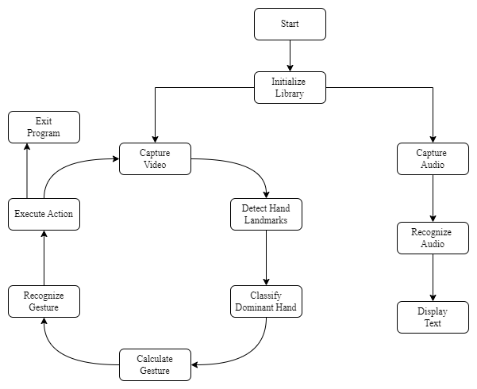
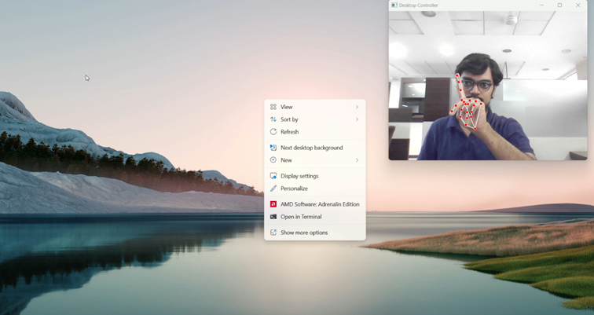
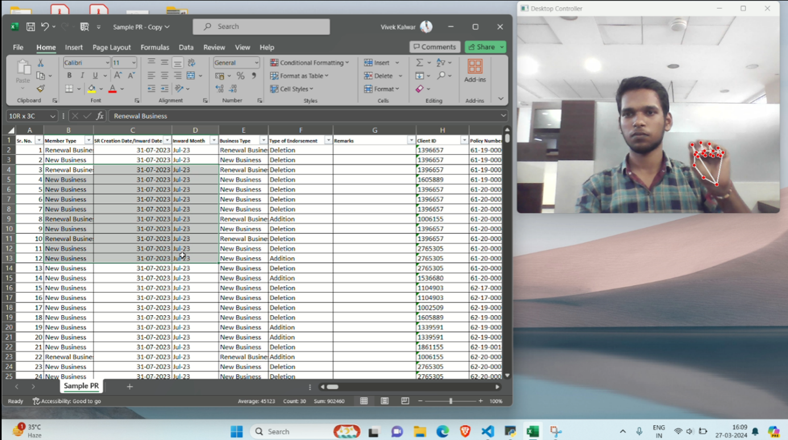
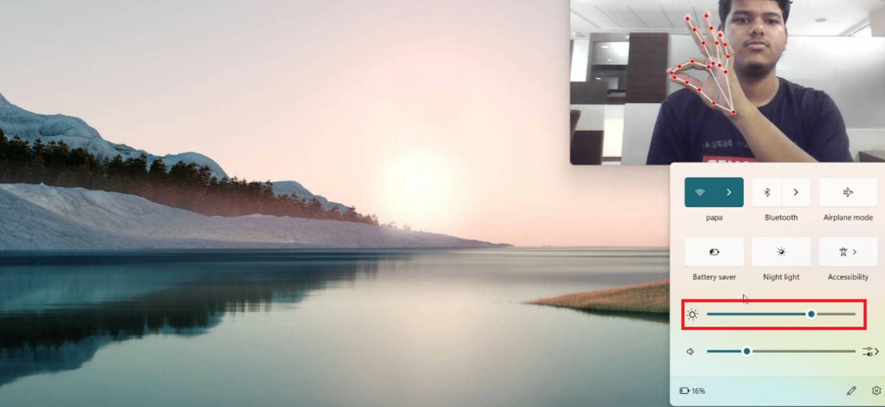
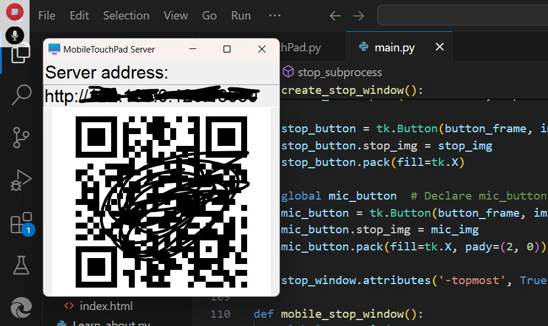
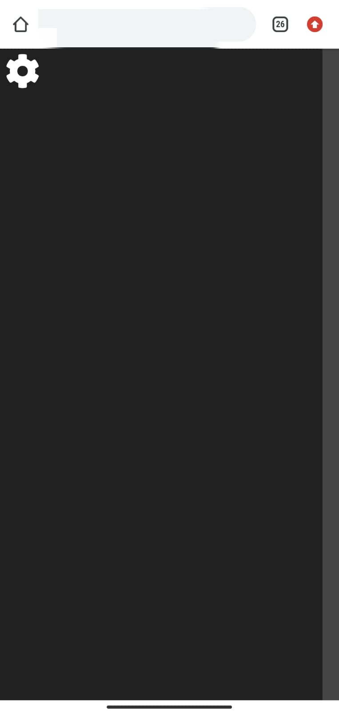

### Visitors :


#  DESKTOP CONTROLLER

We designed and implemented finger tracking based on a virtual mouse application using a regular webcam. Furthermore, we integrated a speech-to-text converter. While touchscreen technology is popular in mobile devices, it is costly for desktop systems. Therefore, we explored computer vision techniques as an alternative method to create a virtual human-computer interaction device, such as a mouse using a webcam and voice commands using a mic.

##  PROPOSED SYSTEM


##  System Software & Hardware Requirements
**1. IDLE:-** Python version 3.8 and above.

**2. OS:-** Windows 8 and above.

**3. RAM:-** 4GB and above.

**4. WEBCAM:-** An Webcam is necessary for input. 

{ If webcam not available then you can use third party application like **[DroidCam](https://droidcam.en.softonic.com/)** or any other that can help you to use your mobile cam. But this DroidCam application should be installed in both android and pc devices for usage. }

**5. MICROPHONE**

##  Installation

For better Working Create an Virtual Environment.
1. Navigate to Your Project Directory:

   ```bash
   cd path/to/your/project
   ```
2. Create a Virtual Environment:

   You can use the venv module that comes with Python:

   ```bash
   python -m venv venv
   ```
3. Activate the Virtual Environment:
   
   ```bash
   .\venv\Scripts\activate
   ```
4. Install Requirements:

   ```bash
   pip install -r requirements.txt 
   ```

5. Run the main.py file:

   ```bash
   python main.py
   ```
##  Demonstrated Pics

1. **Right Click**

   

2. **Multiple Selection**

   

3. **Brightness Control**

   

4. **Double Click**

   

**For Demo Video [Click Here](https://drive.google.com/file/d/1YZv0VA10cUBe4Hj-AIBDiDsm4ATKt6gr/view?usp=sharing)**


##  Additional Work In the Project

Additionally, we have developed a feature to control the mouse using a mobile device's screen. When the user selects "Mobile Controller," a QR code is displayed on the screen. Scanning this code directs the user to a browser page where they can control the mouse by dragging their finger on the page. However, for this to work, both the PC and the mobile device must be on the same network. This only has feature of left click and cursor movement.

<table>
  <tr>
    <td align="center" colspan="2">
      <br>
      <sub><b>QR Code to Scan</b></sub>
    </td>
  </tr>
  <tr>
    <td align="center" colspan="2">
      <br>
      <sub><b>Mobile Browser Page</b></sub>
    </td>
  </tr>
</table>


##  Contributing

Pull requests are welcome. For major changes, please open an issue first
to discuss what you would like to change.

##  COLLABORATORS

<table border="1">
  <tr>
    <th align="center">Name</th>
    <th align="center">Email</th>
    <th align="center">Git ID</th>
  </tr>
  <tr>
    <td align="center">Vivek Kalwar</td>
    <td align="center"><a href="mailto:vivekkalwar95@gmail.com">vivekkalwar95@gmail.com</a></td>
    <td align="center"><a href="https://github.com/Viivveekk">Viivveekk</a></td>
  </tr>
  <tr>
    <td align="center">Prabel Pandey</td>
    <td align="center"><a href="mailto:prabel397@gmail.com">prabel397@gmail.com</a></td>
    <td align="center"><a href="https://github.com/HiPrabel">HiPrabel</a></td>
  </tr>
  <tr>
    <td align="center">Nadeem Khan</td>
    <td align="center"><a href="mailto:kk0078841@gmail.com">kk0078841@gmail.com</a></td>
    <td align="center"><a href="https://github.com/Luciferkhan007">Luciferkhan007</a></td>
  </tr>
</table>


##  License

[MIT](LICENSE) Licensed 
